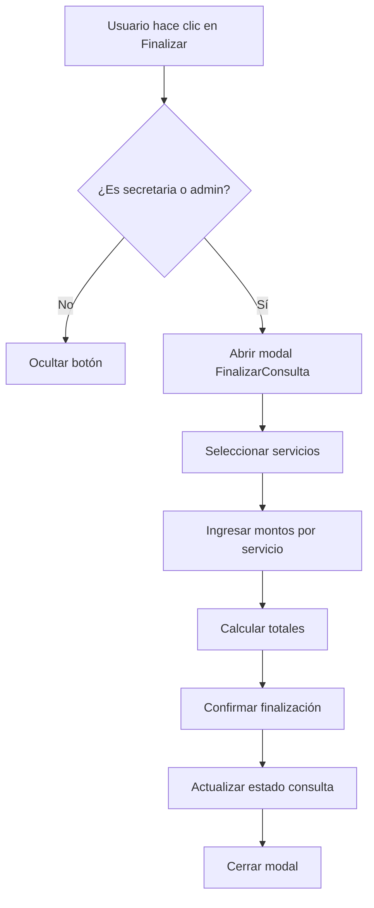

# ESTRATEGIA DE COMPONENTES FRONTEND

## 📁 ESTRUCTURA DE COMPONENTES

```
src/app/components/
├── servicios/
│   ├── servicios-list/
│   │   ├── servicios-list.component.ts
│   │   ├── servicios-list.component.html
│   │   └── servicios-list.component.css
│   ├── servicio-form/
│   │   ├── servicio-form.component.ts
│   │   ├── servicio-form.component.html
│   │   └── servicio-form.component.css
│   └── servicios.module.ts
├── consultas/
│   ├── finalizar-consulta-modal/
│   │   ├── finalizar-consulta-modal.component.ts
│   │   ├── finalizar-consulta-modal.component.html
│   │   └── finalizar-consulta-modal.component.css
│   └── servicios-seleccion/
│       ├── servicios-seleccion.component.ts
│       ├── servicios-seleccion.component.html
│       └── servicios-seleccion.component.css
└── shared/
    ├── moneda-selector/
    │   ├── moneda-selector.component.ts
    │   ├── moneda-selector.component.html
    │   └── moneda-selector.component.css
    └── monto-input/
        ├── monto-input.component.ts
        ├── monto-input.component.html
        └── monto-input.component.css
```

## 🎯 COMPONENTES PRINCIPALES

### 1. **ServiciosListComponent** (Solo Admin)
- **Ruta**: `/admin/servicios`
- **Rol**: `administrador`
- **Funciones**:
  - Listar servicios
  - Crear/editar/eliminar servicios
  - Filtrar por especialidad
  - Activar/desactivar servicios

### 2. **ServicioFormComponent** (Solo Admin)
- **Uso**: Modal para crear/editar servicios
- **Rol**: `administrador`
- **Campos**:
  - Nombre del servicio
  - Especialidad (dropdown)
  - Monto base
  - Moneda (USD/VES)
  - Descripción

### 3. **FinalizarConsultaModalComponent** (Secretaria/Admin)
- **Uso**: Modal para finalizar consultas
- **Rol**: `secretaria`, `administrador`
- **Funciones**:
  - Seleccionar servicios
  - Ingresar montos pagados
  - Calcular totales
  - Finalizar consulta

### 4. **ServiciosSeleccionComponent** (Reutilizable)
- **Uso**: Lista de servicios con selección
- **Funciones**:
  - Mostrar servicios por especialidad
  - Permitir selección múltiple
  - Mostrar precios base

### 5. **MonedaSelectorComponent** (Reutilizable)
- **Uso**: Selector de moneda
- **Opciones**: USD, VES
- **Funciones**:
  - Cambio de moneda
  - Conversión automática

### 6. **MontoInputComponent** (Reutilizable)
- **Uso**: Input para montos
- **Funciones**:
  - Validación de números
  - Formato de moneda
  - Conversión automática

## 🔄 FLUJO DE FINALIZACIÓN



## 🎨 DISEÑO DE MODAL

### **FinalizarConsultaModal**
```
┌─────────────────────────────────────┐
│ Finalizar Consulta                  │
├─────────────────────────────────────┤
│ Paciente: [Nombre del Paciente]     │
│ Médico: [Nombre del Médico]        │
│ Fecha: [Fecha de la consulta]      │
├─────────────────────────────────────┤
│ Servicios Ofrecidos:                │
│ ┌─────────────────────────────────┐ │
│ │ ☑ Consulta Ginecológica        │ │
│ │   Monto: [____] USD/VES         │ │
│ │ ☑ Ecografía Transvaginal       │ │
│ │   Monto: [____] USD/VES         │ │
│ │ ☐ Papanicolaou                 │ │
│ │   Monto: [____] USD/VES         │ │
│ └─────────────────────────────────┘ │
├─────────────────────────────────────┤
│ Total USD: $150.00                  │
│ Total VES: Bs. 5,475.00             │
├─────────────────────────────────────┤
│ Observaciones:                      │
│ [_____________________________]     │
├─────────────────────────────────────┤
│ [Cancelar] [Finalizar Consulta]     │
└─────────────────────────────────────┘
```

## 🔐 CONTROL DE ACCESO

### **Rutas Protegidas**
```typescript
// Rutas de servicios (solo admin)
{
  path: 'servicios',
  component: ServiciosListComponent,
  canActivate: [AdminGuard]
}

// Botón finalizar (solo secretaria/admin)
*ngIf="roleService.hasAnyRole(['secretaria', 'administrador'])"
```

### **Middleware Backend**
```typescript
// Ruta para gestionar servicios
router.get('/servicios', adminSecurityMiddleware, controller.getServicios);
router.post('/servicios', adminSecurityMiddleware, controller.createServicio);

// Ruta para finalizar consultas
router.post('/consultas/:id/finalizar', secretariaSecurityMiddleware, controller.finalizarConsulta);
```

## 📊 MODELOS DE DATOS

### **Servicio Model**
```typescript
interface Servicio {
  id: number;
  nombre_servicio: string;
  especialidad_id: number;
  monto_base: number;
  moneda: 'USD' | 'VES';
  descripcion?: string;
  activo: boolean;
}
```

### **ServicioConsulta Model**
```typescript
interface ServicioConsulta {
  id: number;
  consulta_id: number;
  servicio_id: number;
  monto_pagado: number;
  moneda_pago: 'USD' | 'VES';
  tipo_cambio: number;
  observaciones?: string;
}
```

### **FinalizarConsulta Model**
```typescript
interface FinalizarConsultaRequest {
  consulta_id: number;
  servicios: {
    servicio_id: number;
    monto_pagado: number;
    moneda_pago: 'USD' | 'VES';
  }[];
  observaciones?: string;
}
```

## 🚀 PLAN DE IMPLEMENTACIÓN

### **Fase 1: Base de Datos**
1. ✅ Crear tablas de servicios
2. ✅ Insertar servicios básicos
3. ✅ Crear funciones de cálculo

### **Fase 2: Backend**
1. 🔄 Crear controladores de servicios
2. 🔄 Implementar middleware de roles
3. 🔄 Crear endpoints de finalización

### **Fase 3: Frontend**
1. 🔄 Crear componentes de servicios
2. 🔄 Implementar modal de finalización
3. 🔄 Agregar control de acceso

### **Fase 4: Testing**
1. 🔄 Probar con diferentes roles
2. 🔄 Validar cálculos de montos
3. 🔄 Verificar conversiones de moneda

## 💡 CONSIDERACIONES TÉCNICAS

### **Conversión de Monedas**
- Usar API de tipo de cambio
- Almacenar tipo de cambio del día
- Permitir conversión automática

### **Validaciones**
- Montos no pueden ser negativos
- Al menos un servicio debe ser seleccionado
- Validar que la consulta esté en estado correcto

### **UX/UI**
- Modal responsivo
- Cálculo automático de totales
- Indicadores de carga
- Mensajes de confirmación

